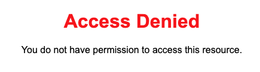
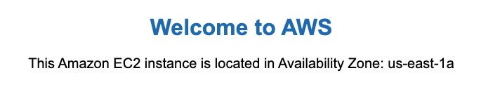
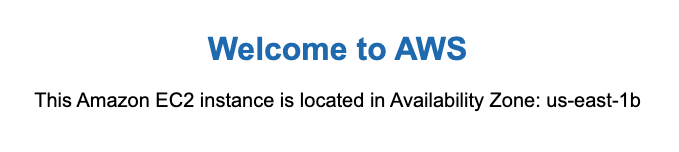
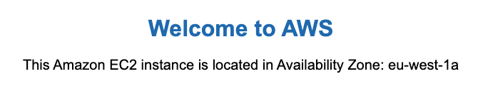
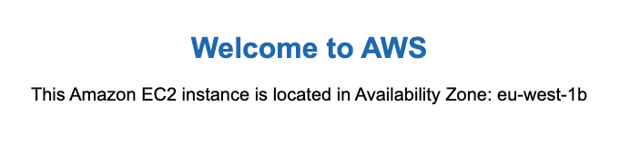

# AWS CloudFront with Multiple Origins

AWS CloudFront is a content delivery network (CDN) service provided by Amazon Web Services (AWS). It is designed to deliver web content to users with low latency and high transfer speeds. CloudFront achieves this by caching content at edge locations around the world, which are closer to the end users. By using AWS CloudFront, you can improve the performance, security, and reliability of your web applications.

This project demonstrates how to set up an AWS CloudFront distribution with multiple origins (primary and failover) and an origin group for failover handling. The origins will be Application Load Balancers in two different regions. The first one will be the primary origin, and the second will serve as a failover origin when the primary is not responding successfully. The CloudFront distribution is configured with a cache policy for caching disabled to easily test the failover behavior.

Both the ALB and Cloudfront are configured with a custom SSL certificate to enable HTTPS. The CloudFront distribution is also configured with a custom header that will be sent for each request to the origin. The ALB will check the presence of the header to serve the response or deny the request otherwise. So the user cannot bypass Cloudfront to call the ALB directly.

Here is the architecture diagram of the solution:


### Prerequisites to deploy this solution
- AWS account with appropriate permissions.
- Basic understanding of AWS services
- AWS CLI installed and configured. All the command lines will be run from the current directory.
- Route 53 domain name

## 1. Web Application Infrastructure

We will use the [web-app](cloudformation/web-app.yaml) CloudFormation template to create the Web Application Infrastructure. This  will deploy a Route 53 record pointing to an Application Load Balancer (ALB) and an Auto Scaling Group of EC2 instances in private subnets across two Availability Zones. The ALB will distribute traffic to the EC2 instances, which will serve a simple web page that displays the AZ of the EC2 instance. The template also creates a VPC, subnets, Internet Gateway, NAT Gateways, Security Groups and route tables.

### 1.1 Parameters

The template accepts the following parameters:

| Parameter Name           | Description                                                                                  | Type   | Default Value  |
|--------------------------|----------------------------------------------------------------------------------------------|--------|----------------|
| `ProjectName`            | The project name that is prefixed to resource names                                          | String | WebApp         |
| `VpcCIDR`                | IP range (CIDR notation) for this VPC                                       | String | 10.0.0.0/16    |
| `PublicSubnet1CIDR`      | IP range (CIDR notation) for the public subnet in the first Availability Zone| String | 10.0.1.0/24    |
| `PrivateSubnet1CIDR`     | IP range (CIDR notation) for the private subnet in the first Availability Zone| String | 10.0.2.0/24    |
| `PublicSubnet2CIDR`      | IP range (CIDR notation) for the public subnet in the second Availability Zone| String | 10.0.3.0/24    |
| `PrivateSubnet2CIDR`     | IP range (CIDR notation) for the private subnet in the second Availability Zone| String | 10.0.4.0/24    |
| `InstanceType`           | EC2 instance type for the web servers                                                        | String | t2.micro       |
| `DomainName`             | The domain name for the Route 53 record                                                      | String |                |
| `HostedZoneId`           | The ID of the Route 53 hosted zone                                                           | String |                |

### 1.2 Resources

The template creates the following resources:

- **VPC**: A Virtual Private Cloud with the specified CIDR block.
- **Subnets**: Public and private subnets in each of the two Availability Zones for high availability and fault tolerance.
- **Internet Gateway**: An Internet Gateway for internet access in public subnets.
- **NAT Gateways**: NAT Gateways with assigned Elastic IP in each AZ for outbound internet access from private subnets.
- **Public Route table**: Public route table to define the routing rules for the traffic in the public subnet.
- **Private Route table**: Private route table in each AZ to define the routing rules for the traffic in the private subnet.
- **Auto Scaling Group**: An ASG that will launch two EC2 instances in private subnets and  maintain the desired number of EC2 instances depending on the load. 
- **EC2 instance**: Each EC2 instance launched by the ASG will run a simple web server to display the current availability zone.
- **Application Load Balancer**: An ALB in the public subnet to distribute the traffic between the EC2 instances.
- **Security Groups**: Security groups as firewall to control the network access to the EC2 instances and the ALB.
- **ACM Certificate**: This certificate will be used by the Application Load Balancer to enable HTTPS traffic.
- **Route 53 record**: Route 53 record with a simple routing from a user friendly domain name to the  the Application Load Balancer.

All the resources are tagged with the project name to easily identify them in the AWS Management Console and for billing purposes.

### 1.3 Outputs

The template provides the following output:

- **Load Balancer Alias**: The URL of the website that is served by the Application Load Balancer

### 1.4 Deployment

You can deploy the CloudFormation stack by using the AWS Management Console or running the following AWS CLI command. You will need to deploy the stack in two different regions to test the failover handling with Cloudfront. We use us-east-1 and eu-west-1 in our example, but you can choose your regions of preference.

```sh
aws cloudformation create-stack \
  --stack-name web-app-stack \
  --template-body file://cloudformation/web-app.yaml \
  --parameters ParameterKey=ProjectName,ParameterValue=WebApp \
               ParameterKey=VpcCIDR,ParameterValue=10.0.0.0/16 \
               ParameterKey=PublicSubnet1CIDR,ParameterValue=10.0.1.0/24 \
               ParameterKey=PrivateSubnet1CIDR,ParameterValue=10.0.2.0/24 \
               ParameterKey=PublicSubnet2CIDR,ParameterValue=10.0.3.0/24 \
               ParameterKey=PrivateSubnet2CIDR,ParameterValue=10.0.4.0/24 \
               ParameterKey=DomainName,ParameterValue=<my-domain-name> \
               ParameterKey=HostedZoneId,ParameterValue=<my-hosting-id>
```

## 2. CloudFront Infrastructure

We will use the [cloudfront](cloudformation/cloudfront.yaml) CloudFormation template to create the CloudFront Infrastructure. This  will deploy a CloudFront distribution using the two application load balancers deployed in the previous step as origins. They will be configured in an origin group for failover handling. The template also creates a Route 53 record that will use your domain name as an alias for the CloudFront distribution.

### 2.1 Parameters

The template accepts the following parameters:

| Parameter Name                      | Description                                                                                  | Type   | Default Value  | Allowed Values          |
|-------------------------------------|----------------------------------------------------------------------------------------------|--------|----------------|-------------------------|
| `ProjectName`                       | The project name that is prefixed to resource names                                          | String | CloudFront     |                         |
| `CloudFrontPriceClass`              | The price class for the CloudFront distribution                                              | String | PriceClass_All | PriceClass_100, PriceClass_200, PriceClass_All |
| `PrimaryApplicationLoadBalancerURL` | The URL of the primary application load balancer (Output of the web-app stack in the primary region)                                             | String |                |                         |
| `FailOverApplicationLoadBalancerURL`| The URL of the failover application load balancer (Output of the web-app stack in the failover region)                                            | String |                |                         |
| `DomainName`                        | The domain name that will be used as an alias to point to the CloudFront distribution                                              | String |                |                         |
| `HostedZoneId`                      | The ID of the Route 53 hosted zone of the domain name                                                           | String |                |                         |

### 2.2 Resources

The template creates the following resources:

- **Certificate**: A certificate to enable HTTPS for the CloudFront distribution. This certificate must be created in us-east-1 region.
- **CloudFront Distribution**: A CloudFront distribution with two origins (primary and failover) and an origin group for failover handling. The distribution is configured with a custom header and SSL certificate. It is also configured with a cache policy for caching disabled to easily test the failover behavior.
- **Route 53 record**: A Route 53 record as an alias that points to the CloudFront distribution's domain name.

### 2.3 Outputs

The template provides the following outputs:

- **Domain name**: The domain name of the website to access the CloudFront distribution

### 2.4 Deployment

You can deploy the CloudFormation stack using the AWS Management Console or running the following AWS CLI command. You will have to deploy this stack in us-east-1 because CloudFront certificate must be created in the us-east-1 region.

```sh
aws cloudformation create-stack \
    --stack-name cloudfront-stack \
    --template-body file://cloudformation/cloudfront.yaml \
    --parameters ParameterKey=ProjectName,ParameterValue=Cloudfront \
               ParameterKey=CloudFrontPriceClass,ParameterValue=PriceClass_All \
               ParameterKey=PrimaryApplicationLoadBalancerURL,ParameterValue=<primary-website-url> \
               ParameterKey=FailOverApplicationLoadBalancerURL,ParameterValue=<failover-website-url> \
               ParameterKey=DomainName,ParameterValue=<my-domain-name> \
               ParameterKey=HostedZoneId,ParameterValue=<my-hosting-id>
```

## 3. Testing the Solution

After deploying both the Web Application and CloudFront infrastructure, you can test the solution by accessing the domain name. The CloudFront distribution will route traffic to the primary application load balancer. If the primary load balancer is not responding, the traffic will be routed to the failover load balancer.

### 3.1 Testing the Application Load Balancer

When you bypass CloudFront and access the application load balancer URL (Output of the web-app stack with HTTPS), you will get a 403 Forbidden error because the ALB is configured to check the presence of a custom header provided by CloudFront. If the header is not present, the ALB will deny the request.



### 3.2 Testing the CloudFront Distribution

When you access the domain name that points to the CloudFront distribution, you will see the web page served by the primary application load balancer. You can access it many times to see that the availability zone changes because the ALB distributes the traffic between the EC2 instances in different AZs.





### 3.3 Testing the Failover Handling

To test the failover handling, we will use the AWS Management Console to edit the security group of the EC2 instances ("WebApp-EC2-Security-Group") in the primary region and remove the inbound rule that allows HTTP traffic from the ALB. This will simulate a 504 Gateway Timeout error when accessing the domain name. Then the CloudFront distribution will route the traffic to the failover application load balancer in the other region after a few seconds. You can access the domain name many times to see the failover application load balancer distributing the traffic between the EC2 instances in different AZs.





## 4. Cleanup the resources

After testing, you can cleanup the resources to avoid the cost of AWS running services.
To delete the stacks and all associated resources, you can use the AWS Management Console or run the following commands. The web-app stack must be deleted in both regions.

```sh
aws cloudformation delete-stack --stack-name cloudfront-stack
aws cloudformation delete-stack --stack-name web-app-stack
```